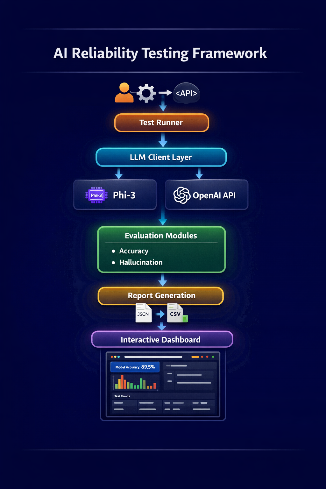

# AI Reliability Testing Framework

> Production-style evaluation framework for testing LLM accuracy, hallucinations, consistency and reliability.

[]
[]
[]
[]

---

# Why this project exists

LLMs are powerful but unreliable.

They:
- Hallucinate facts
- Produce inconsistent answers
- Fail silently
- Cannot be trusted without evaluation

Companies building AI products need **AI Reliability Engineering**.

This project aims to provide a **practical testing framework for LLM systems**, similar to how Selenium enabled web testing.

---

# Project Vision

This project aims to become an **open source reliability testing framework for LLM systems**.

Inspired by:

- OpenAI Evals
- DeepEval
- MLFlow evaluation
- LangChain testing
- Reliability engineering practices

Goal:

Provide engineers tools to test:

Accuracy  
Hallucinations  
Consistency  
Latency  
Failure cases  

---

# Key Features

- Modular LLM interface
- Supports local + API models
- Accuracy evaluation (semantic similarity)
- Hallucination detection
- Automated reports
- Visual dashboards
- Extensible architecture
- Dataset driven testing

---
# Project Structure Guide

The project follows a modular AI evaluation architecture.

ai_reliability_framework/

datasets/
    qa_dataset.json
    hallucination_dataset.json
    Purpose:
    Stores evaluation datasets used for testing models.

llm/
    llm_client.py
    model_interface.py (planned)

    Purpose:
    Handles model communication layer.
    Abstracts model calls from evaluators.

evaluation/
    accuracy_evaluator.py
    hallucination_evaluator.py

    Purpose:
    Contains evaluation logic and reliability metrics.

tests/
    test_runner.py
    test_llm_connection.py
    test_hallucination.py

    Purpose:
    Executes evaluation workflows.

reports/
    accuracy/
    hallucination/

    Purpose:
    Stores generated evaluation reports.

visualization/
    dashboard.py
    hallucination_dashboard.py

    Purpose:
    Streamlit dashboards for visual analysis.

utils/
    dataset_loader.py
    report_writer.py

    Purpose:
    Helper utilities for loading data and saving reports.

config/
    model_config.py

    Purpose:
    Configuration for model selection and parameters.

# Quick Start Guide

Follow these steps to run the project locally.

---

# Step 1 Clone Repository

git clone https://github.com/mahmad321git/ai_reliability_framework.git

# Step 2 Create Virtual environment - Windows

python -m venv venv

venv\Scripts\activate

# Step 2.1 Create Virtual environment - Mac/Linux
python -m venv venv

python -m venv venv

source venv/bin/activate

# Step 3 Install Dependencies
pip install -r requirements.txt
Step 4 Run LLM Connection Test
python tests/test_llm_connection.py

Expected output:

Model connected successfully
Sample response generated

# Step 4 Run Accuracy Testing
python tests/test_runner.py

Output:

Accuracy Report Generated

# Step 5 Run Hallucination Testing
python tests/test_hallucination.py

Output:

Hallucination report generated

# Step 6 Launch Dashboard

Accuracy dashboard:

streamlit run visualization/dashboard.py

Hallucination dashboard:

streamlit run visualization/hallucination_dashboard.py

Open browser:

http://localhost:8501

# System Architecture
